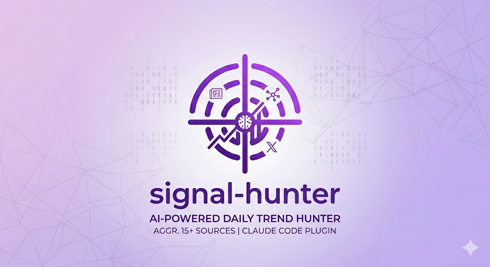

<p align="center">
  
</p>

<p align="center">
  <strong>AI-powered daily trend hunter</strong><br>
  Aggregates 20+ sources, scores cross-source signals, generates Obsidian notes with business ideas.
</p>

---

## What it does

Every day, it collects from:

| Source | Method | What you get |
|--------|--------|-------------|
| Hacker News | WebFetch | Top stories with points and comments |
| Product Hunt | WebFetch | Top products with taglines and upvotes |
| GitHub Trending | WebFetch | Trending repos with stars and descriptions |
| HuggingFace | WebFetch | Trending papers with likes |
| smol.ai | WebFetch | AI news summaries |
| Superhuman AI | WebFetch | Curated AI newsletter content |
| Ben's Bites | WebFetch | AI startup and product coverage |
| TechCrunch AI | WebFetch | Enterprise AI news and funding |
| Futurepedia Innovations | WebFetch | Top 100 tech company AI developments |
| Reddit | Python API | Top 10 posts/day per subreddit (incl. LocalLLaMA) |
| YouTube | RSS + transcripts | New videos with summarized transcripts |
| X/Twitter | X API v2 | Latest tweets from accounts you follow |
| Gmail | Gmail MCP | Auto-discovered newsletter content |
| Futurepedia Tools | API Endpoint | New AI tool launches (structured JSON) |
| App stores | Playwright | Trending apps from AppMagic, AppRaven |

Then it:
1. **Scores** every item (0-100 normalized across sources)
2. **Detects cross-source signals** with 1.5x multiplier for topics in 2+ sources
3. **Tracks newsletter mentions** with +15 bonus (human-curated = strong signal)
4. **Tracks velocity** across 7 days (accelerating, new, fading, steady)
5. **Detects app store gaps** for trending topics with no existing apps
6. **Summarizes YouTube transcripts** into 5 bullet points + key quote
7. **Generates up to 3 business ideas** per day (app, SaaS, BaaS, gaming, dev-tools)
8. **Writes markdown notes** to any folder (works great with Obsidian, but not required)
9. **Sends email digests** via Gmail SMTP to you or a Google Group
10. **Caches everything** with historical data preserved per day

## Install

```bash
python3 -m venv .venv
.venv/bin/pip install -r requirements.txt
.venv/bin/playwright install chromium

cp config.yaml.example config.yaml
# edit config.yaml with your sources and output path

# optional: X/Twitter API and Gmail SMTP
echo "X_BEARER_TOKEN=your_token" > .env
echo "GMAIL_ADDRESS=you@gmail.com" >> .env
echo "GMAIL_APP_PASSWORD=xxxx xxxx xxxx xxxx" >> .env
```

Or run `/setup` in Claude Code.

## Usage

### As a Claude Code plugin

```
/digest              # run the full daily pipeline
/weekly              # generate weekly trend report
/add-source <url>    # add a new source (auto-categorized)
/test-source reddit  # test a category
/list-sources        # show all configured sources
```

### As a script

```bash
.venv/bin/python -m src.collector              # run all scrapers
.venv/bin/python -m src.scoring                # velocity + scores
.venv/bin/python -m src.scoring --weekly       # weekly aggregate
.venv/bin/python -m src.collector --test reddit # test one category
.venv/bin/python -m src.collector --force       # ignore daily cache
```

## Configuration

Copy `config.yaml.example` to `config.yaml` and customize:

```yaml
sources:
  reddit:
    - subreddit: singularity
    - subreddit: AINewsMinute

  youtube:
    - channel: "@AIDailyBrief"
      channel_id: UCKelCK4ZaO6HeEI1KQjqzWA

  twitter:
    - handle: nlw
    - handle: edsim

scoring:
  weights:
    hackernews: { divisor: 10 }
    reddit: { divisor: 5 }
    gmail: { default: 70 }
  cross_source_multiplier: 1.5
  newsletter_mention_bonus: 15

email:
  enabled: true
  recipients:
    - your-group@googlegroups.com

# Output directory — any folder works, Obsidian is optional
output:
  vault_path: ~/Documents/signal-hunter-output
  daily_folder: Daily
  ideas_folder: Ideas
  weekly_folder: Weekly
```

### X/Twitter API (optional)

1. Go to [developer.x.com](https://developer.x.com)
2. Create a project, generate a Bearer Token
3. Add to `.env`: `X_BEARER_TOKEN=your_token`

### Gmail SMTP (optional)

1. Enable 2FA on your Google account
2. Generate an app password at [myaccount.google.com/apppasswords](https://myaccount.google.com/apppasswords)
3. Add to `.env`: `GMAIL_ADDRESS` and `GMAIL_APP_PASSWORD`

### Gmail MCP (optional)

For newsletter auto-discovery, enable the Claude Gmail plugin in Claude Code settings.

## Output

Markdown files written to your configured `vault_path` (any folder — Obsidian is optional):

```
output/
  Daily/
    2026-03-25.md                          # daily digest with scored trends
  Ideas/
    idea-2026-03-25-ai-security.md         # up to 3 ideas per day
    idea-2026-03-25-agent-monitoring.md
    idea-2026-03-25-task-manager.md
  Weekly/
    2026-W13.md                            # weekly rollup
```

Email digests are also sent to configured recipients with the same content.

## How trend detection works

The system catches emerging signals early by combining multiple detection methods:

1. **Score normalization** (0-100) across all source types
2. **Tiered cross-source multiplier** (1.3x for 2 sources, 1.5x for 3+) to reward true convergence
3. **Newsletter mention bonus** (+15) because human-curated newsletters are strong signal amplifiers
4. **Velocity tracking** against 7 days of cached data
5. **Cross-day deduplication** — each topic is marked `fresh`, `deepened` (new angle/sources), or `repeat` (same story, skipped). Only genuinely new or evolved stories surface in the digest.
6. **App store gap detection** to find market opportunities
7. **Weekly rollups** categorizing persistent trends, flash signals, and rising topics

## License

MIT
